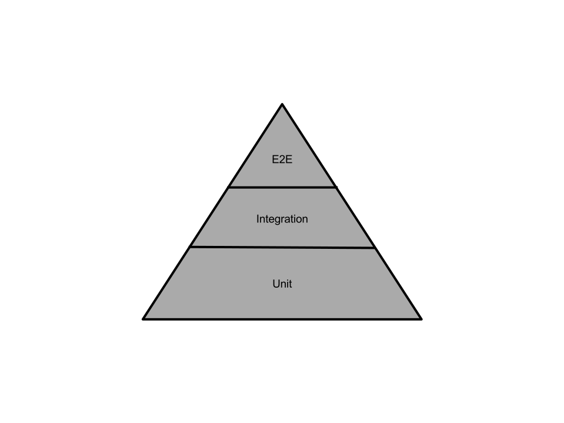

# Development guidelines

1. [Codebase](#codebase)
    1. [Coding Style](#coding-style)
       1. [High Level Code Conventions](#high-level-code-conventions)
       1. [Semantic HTML](#semantic-html)
            1. [Semantic Sectioning](#semantic-sectioning)
            1. [Semantic Headings](#semantic-headings)
            1. [Extra Semantic Elements](#extra-semantic-elements)
    1. [Linting](#linting)
    1. [Component Styling](#component-styling)
       1. [SCSS Modules](#scss-modules)
       1. [Sass Module System](#sass-module-system)
       1. [SCSS Linting](#scss-linting)
1. [Folder and File Structure](#folder-and-file-structure)
    1. [Code Re-use](#code-re-use)
    1. [Tightly Scoped Code](#tightly-scoped-code)
    1. [Naming Conventions](#naming-conventions)
    1. [Declaration files](#declaration-files)
        1. [Tightly Scoped Interfaces and Types](#tightly-scoped-interfaces-and-types)
        1. [More Generic Interfaces and Types](#more-generic-interfaces-and-types)
1. [Project Workflow](#project-workflow)
    1. [Version Control](#version-control)
    1. [Branch Based Development](#branch-based-development)
       1. [Long Running Feature Branches](#long-running-feature-branches)
       1. [Branching](#branching)
       1. [Merging](#merging)
1. [Application Bundling](#application-bundling)
1. [Developing](#developing)
    1. [Development Setup](#development-setup)
    1. [Hot Module Reloading](#hot-module-reloading)
1. [Building](#building)
1. [Testing](#testing)
    1. [Test Pyramid](#test-pyramid)
    1. [Unit Tests](#unit-tests)
        1. [Code Coverage](#code-coverage)
        1. [Unit Test Configuration](#unit-test-configuration)
        1. [Unit Test Style](#unit-test-style)
        1. [Running Tests](#running-tests)

## Codebase
The codebase should take advantage of TypeScript and while modern JS is permitted it is not preferred. The project 
includes style rules and linting, primarily derived from [Google TypeScript Style](https://github.com/google/gts).

### Coding Style
Automated style rules are currently the default rules set-up by GTS; should anything become impractical then the team can 
discuss a modification to the rules. In addition to these some general principles are provided below for the team to 
follow.

#### High Level Code Conventions
Generally speaking the codebase should be aligned with the following principles:
- DRY (Don't Repeat Yourself!)
- Composition over Inheritance
- Functional where possible
  - Preferably pure, no side effects
- Well structured Classes if necessary
  - Use private member and methods
  - Only expose methods that should be the public interface for other object
  - Use static methods when the instance is not important
  - Avoid 'member functions'
  - Be sure to include a tear-down, destroy method where applicable
    - this is to aid garbage collection and minimize risk of memory leaks
- Classes and modules should try to follow the [Rule of 30](https://dzone.com/articles/rule-30-%E2%80%93-when-method-class-or)
  - Maximum average of ~30 lines of implementation (excluding line spaces and comment lines) code per function
  - Maximum average ~30 functions per Class/Module (so no more than ~900 lines of implementation per file
  - *Implementations greatly exceeding these sizes will be requested to be refactored*
- Use block scope over nested closures (IIAF))
- Avoid nested functions, instead preferring calling methods or using currying to return functions
  - this is to improve maintainability to code
- Top level functions should be declared using the `function` keyword
  - Avoid assigning anonymous functions to `const` variables
  - See https://www.freecodecamp.org/news/constant-confusion-why-i-still-use-javascript-function-statements-984ece0b72fd/
- Use descriptive names for everything
  - Longer is better than terse
    - the bundler will minify this
  - Class and Module names describe role
  - Value declarations describe content 
  - Methods and functions use the imperative to define the action
  
#### Semantic HTML
The HTML generated must be semantically meaningful, this has SEO benefits as well as the ability to make use of features
 of modern browsers, like extra interactions (for `<details><summary/></details>` for example) and _read mode_. It's 
 important to put text content inside inline text elements as well as considering what it the right block level element 
 to best describe a content block.
 
##### Semantic Sectioning
 It's really worth taking the small amount of time it takes to consider the role a chunk of cnotent has relative to the 
 parent and applying a containing element accordingly. The most important elements to understand and apply for creating 
 a semantic structure for the web view are: `<article>`, `<aside>`, `<footer>`, `<header>`, `<main>`, `<nav>`, 
 `<section>`; please become familiar with their correct usage if you are not already and apply this knowledge.
  
##### Semantic Headings
 Headings should correctly cascade, so there should not be an `h3` where there is no previous `h1` then `h2` as headings
 have meaning that is picked up by search engines. If the block level element that is the parent of a heading is one 
 that marks a some content as standalone, like `article` or `section` then theoretically, multiple heading cascades are 
  permitted but not recommended. Ideally, the html generated should be able to have dynamic heading elements to account 
  for content nesting.
  
##### Extra Semantic Elements
For bonus points, some elements can be used to wrap content and provide extra information that is machine readable, like
 the `date` and `value` elements. When these are used it improved search engine parsing of the content.

Further reading:
- https://developer.mozilla.org/en-US/docs/Glossary/Semantics#Semantics_in_HTML
- https://developer.mozilla.org/en-US/docs/Web/Guide/HTML/Using_HTML_sections_and_outlines
- https://www.w3.org/TR/2014/REC-html5-20141028/sections.html#headings-and-sections
- https://webdesign.tutsplus.com/articles/targetText=Why%20Multiple%20Tags%20Are,sectioning%20root%20or%20content%20section.
- https://learn-the-web.algonquindesign.ca/topics/html-semantics-cheat-sheet/
- https://www.hostinger.co.uk/tutorials/html-cheat-sheet
  
### Linting
Code linting applies the rules used to check the codebase for contravening code style; this will become part of a 
pre-commit step as well as in the test stage of the CI pipeline to ensure some consistency.

The standalone command to run linting is:
```shell script
npm run lint
``` 

If there are linting errors, the command to fix the code style is:
```shell script
npm run lint:fix
``` 

### Component Styling
Use SCSS and also CSS modules; styles for a given component should be located adjacent to the component they are applied
 to but written up in SCSS. Common values such as padding and colours should be included in a global SCSS file but this 
 is not a dumping ground for miscellanea, it is so that variables, functions and mixins can be shared and used across 
 the other style files.

#### SCSS Modules
(S)CSS Modules allow for better scoping of styles, so as to better guarantee no cascade conflicts, with the added 
benefit that the class names as accessible via an Object based dictionary. 

For more reading on this topic, see:
- https://github.com/css-modules/css-modules

To import styles as modules can be done as demonstrated below.

In reality a map of the scss classnames is imported
```typescript jsx
import componentStyles from './component.scss'
```
which this can be applied to the JSX as in the example below:
```typescript jsx
return <Component classname={componentStyles.componentClassName} />
```

#### Sass Module System
We use the Sass module system to better control how scss files are used with one another. Using `@use` omsgtead of 
`@import` prevents styles from being imported globally and allows for private methods/members; to use included scss 
files within another scss file, it's important to access values via the scss file namespace, which be default is the 
name of the file. For more information read this 
['blog post'](http://sass.logdown.com/posts/7858341-the-module-system-is-launched).

Example of Sass module system in use:
```scss
@use '~/app/shared/styles/ui';

.title {
  @include ui.large-copy;
}
```


#### SCSS Linting
Linting of SCSS is yet to be defined but will be included in the project to afford to the SCSS, the same consistency 
applied to the TypeScript/JavaScript.


## Folder and File Structure
Organize your files around product features/pages/components, not roles, so long as this adheres to DRY.

**Bad**
```
    .
    ├── views
    |   ├── product.ts
    |   └── user.ts
    ├── reducers
    |   ├── product.ts
    |   └── user.ts
```

**Good**
```
    .
    ├── product
    |   ├── Product.tsx
    |   ├── Product.test.tsx
    |   ├── ProductReducer.ts
    |   ├── ProductReducer.test.ts
    |   └── product.scss
    ├── user
    |   ├── User.tsx
    |   ├── User.test.tsx
    |   ├── UserReducer.ts
    |   ├── UserReducer.test.ts
    |   └── user.scss
```

### Code Re-use

_NOTE:_ Where code needs to be re-used across disconnected areas of the application then the code belongs in the `shared` 
folder; this applies to components, partials, even utility functions.

**High level abstraction**
```
    .
    ├── shared
    |   ├── components/
    |   ├── partials/
    |   └── utils/
    ├── views
    |   ├── user/
    |   └── product/
```

### Tightly Scoped Code

_NOTE:_ Where code is tightly coupled to a single part of the application, so that its scope is only for a particular 
area then the code should sit within the context of the parent scope as nested resource; this applies to components, 
partials, even utility functions.

This makes sense for components and partials that are only ever used in a single context as it's easier to maintain and 
test the codebase by having separate files for discrete functionality beyond a certain size while still grouping them 
with their only use case.

**Scoped modules**
```
    .
    ├── user
    |   ├── components/
    |   ├── partials/
    |   ├── utils/
    |   ├── User.tsx
    |   └── user.scss
```

### Naming Conventions

In order to maintain consistency of naming as well as structure please observe the following list of guidelines for file
 and folder naming as well as file placement:

* Place your test files next to their implementation.
* Place your styles files next to their components.
* Put your scripts in a `./scripts` folder. This includes `bash` and `node` scripts for tooling, build and bundling and 
so on.
* Naming
    * Use `kebab-case` for directory names (consider folders like namespaces)
    * Use `PascalCase` for Components/Partials/Views or other TS/JS modules (like Classes and Objects)
      * If there is a corresponding SCSS module file, it should have the same ame but adopting `kebab-case` pattern
    * Use `camelCase` for all other files
    * Any file using or testing a JSX template should have a `.jsx` or `.tsx` file extension
    * A test spec file should have the same name as the file it is testing albeit with a _pre-file-extension-suffix_ of
    `.test`, eg: `ClassName.ts` becomes `ClassName.test.ts`

### Declaration files

#### Tightly Scoped Interfaces and Types

Where a module requires or benefits from declaring a type of interface that is tightly scoped to the purpose of the 
module then a separate, corresponding declaration file should be created; including interfaces and types in the 
implementation file does not scale well and a cleaner approach is to arrange of the types together in their own file. 

For example, where a file `MyComponent.tsx` requires a interfaces and types, they should be located in the same folder 
in a filed named `MyComponent.d.ts`.

#### More Generic Interfaces and Types

Some interfaces will be better suited to being placed in a less scoped context, this may be because they are defining a: 
very general pattern or structure in TypeScript; or they define an interfaces for API JSON payloads; or they define an 
internal DTO (data transfer object) that the application uses to pass around data between multiple modules.

If an interface/type is used more globally across the application then it belongs in one of three files:
- [/src/app/declarations/common.ts](../src/app/declarations/common.ts) - for generic TypeScript
- [/src/app/declarations/api.ts](../src/app/declarations/api.d.ts) - for API response data
- [/src/app/global/models.d.ts](../src/app/global/models.d.ts) - for internal DTOs.

## Project Workflow

Project workflow adopts a flavour of agile, applying the concept of work being broken up and grouped under a hierarchy 
of Epics, Stories, and Tasks (see [_Epics, Stories, Themes, and Initiatives_](https://www.atlassian.com/agile/project-management/epics-stories-themes)).  
JIRA is the software tool used to create and manage workflow in terms of track-able defined objectives. The tasks are 
the smallest unit of work and should be undertaken in isolation against a copy of the codebase before being merged with 
the original version of the codebase or possible a story/feature version of the codebase; this is achieved using 
_version control_ and helps guarantee that the main version of the codebase is as stable and bug-free as possible at all
 times.

### Stories and Tasks Definitions
When being given a unit of work to complete, this will be in the form of a JIRA ticket. Story and task definitions 
describe what is the user centred expected functionality and what needs adding/fixing in order to achieve the desired 
result.

The ticket should be be composed with enough information for you to complete the task before you begin, if you have any 
questions it is better not to make assumption but instead get clarification on the matter and have the ticket updated. 

The structure of a well formed ticket should adhere to the following:
- The description should be fleshed out to describe 
  - the user scenario for wherein the behaviour belongs
  - the expected cause and effect of the behaviour
- A list of acceptance criteria against which the task should be evaluated
- For UI works, links to wire-frames or embedded UI images

In addition to the checking ticket acceptance criteria, the task is bound by the 'User Story DoD'; for more information,
 please refer to the 'User Story DoD' in the [Definition of Done](https://docs.google.com/document/d/1HTVtG8suf-KuqKoogGINpoquZTnKq4vNujbqqVxxo-k/edit?usp=sharing)
 document on Google Drive for the checklist of requirements that should be met before new work is merged into the 
 existing codebase.

### Version Control
The version control tools/services used for the project are Git and Bitbucket; Git is essentially the technology used to
 allow the _branching_ of the codebase so that a user can work on different versions in isolation but with the easy 
 facility of introducing the additional work back into the main version once the work is complete. To work on the 
 project soe basic familiarity with Version control, especially Git is essential 
 (see [What is version control](https://www.atlassian.com/git/tutorials/what-is-version-control)). When working on the 
codebase, work is undertaken locally using Git to manage changes and when the user wants to backup their changes or 
request that their changes are merged, Bitbucket is the service used to manage the centralised repository of the code.

### Branch Based Development
In terms of application development, the Stories and Tasks translate into _branches_ where new functionality is worked 
on before it is peer reviewed, and then_merged_ back into the main _trunk_ of the project Git repository. The main 
version of the project, referred to as the trunk, is named `dev` in this project, and all stories should be 
derived from the latest version of `dev` at the point at which the story is started; this also assumes to simple stories
 that are in effect single tasks but if a story needs to be broken up into tasks, these tasks should branch off from the
 story branch (effectively behaving as a feature branch) for the story they belong to. In normal working conditions, 
 branches only ever get merged back into the parent branch they are derived from. There is a `master` branch which 
 should *not* be developed against, as this is acting as the latest release candidate, only ever being merged into from 
 dev.

For more information in general about branch based development, see 
[_The essence of branch-based workflows_](https://www.atlassian.com/blog/git/the-essence-of-branch-based-workflows).

#### Long Running Feature Branches
Branches based on stories with sub-branches for tasks should ideally not exist for longer than the lifetime of a sprint.
 In the event that a feature branch needs to be ongoing for an unusual length of time, it is the responsibility of the 
 owner of the story to keep it up-to-date with `dev` and communicate with the owners of the child branches to update 
 their branches when the parent branch has updated.

#### Branching
As previously described, all development branches derive from `dev` by either branching directly or branching from a 
story branch derived from `dev`. This can be done using Git locally, or using the web interface for JIRA, which has 
Bitbucket integration. Using the web interface to branch is the recommended option as it has the advantage of linking 
the Bitbucket branch with the corresponding JIRA stories/tasks, so that their states can be seamlessly synced. The 
naming convention of the JIRA generated branch name, when branching via the web interface prefixes the JIRA ticket id to
 the front of the branch name, followed by the serialised (kebab-case) ticket name; if a user intends on creating a 
 branch manually, then it is possible to achieve the synced JIRA and Bitbucket behaviour by similarly prefixing the 
 branch name with the JIRA ticket id, though this is not guaranteed to work 100% of the time.

#### Merging
merging into `master` from `dev` is a special case so what follows need not apply but for the development branches the 
following is preferred practice:

- Where possible always rebase your branch with the latest version of your parent branch before merging
  - only if absolutely necessary merging in this direction is permitted
- Ensure your branch is conflict-free, builds and all tests pass before merging into the parent branch
- When merging into your parent branch, set the merge to squash your branch commits
  - this is to keep the version history log readable
- Merging should not be done locally but instead initiated via a PR (pull request) in Bitbucket
  - this is so the changes can be peer reviewed and approved before being merged
  - When a merge is approved, the child branch should be deleted upon merging

## Application Bundling

The project uses Parcel to bundle the application both for development and build. It has been chosen as the simplest 
option to deliver (relatively) pain-free bundling configuration, so more time can be spent on application development.
Parcel promises 'zero-configuration', though some set-up is required via the configuration of other aspects of the 
toolchain (like `tsconfig`, `babelrc`, `postcssrc`).
 
Currently Parcel is being called via the command line with all of its own default configuration intact; only in the 
event that it's absolutely necessary will Parcel be called via a script.

## Developing
Starting the app in development mode is as simple as running the `start` script with your chosen node package manager, 
be it `npm` or `yarn`.

### Development Setup

_*[Add setup details here if necessary.]*_

### Hot Module Reloading
You will need to turn off ['Safe Write'](https://parceljs.org/hmr.html#safe-write) in your IDE/text-editor in order to 
allow the Parcel file watcher to pick up the changes.

## Building
Running `npm run build` will output the bundled application to the `dist` folder; this can then be accessed by opening ]
the index.html file locally within a a browser. Should you wish to serve the build files locally then the command is 
`npm run serve`.

## Testing

(For more information on testing practices please see the [Testing Guidelines](testing.md) document)

Initially testing will be purely Unit tests but eventually the following tests will be applied:
- [x] Unit Tests
- [ ] Functional Tests
- [ ] Integration Tests
- [ ] End To End Tests
- [ ] Acceptance Tests

### Test Pyramid

The test pyramid describes the varying level of test coverage applied to different types of tests, such that code is 
tested more thoroughly the more granular the amount of code that is being evaluated; that is to say that as the amount 
of code being tested expands to include more functionality the level of testing decreases.

The rationale is that it is easier and faster to repeatedly test fragments of an implementation in sandboxed 
environments whereas is is more complicated and time consuming to test implementations when composed into larger 
systems; not only this, but if done correctly, the larger test base for unit tests should catch errors earlier which is 
better.

**Example Test Pyramid**



### Unit Tests
To begin with, code coverage by percentage will not be adhered to with a high value. The approach for testing will apply
 a relaxed style of Behaviour Driven Development (BDD) as a more pragmatic attitude to applying test coverage. What this 
 means in real terms is that units of code being evaluated by test code will not be expected to be tested as rigourously
 as to cover every edge case but at least cover the primary use cases (and perhaps at least that the code will or won't 
 throw exceptions for the most basic forms of invalid arguments).

#### Code Coverage
To begin with this will be a relatively low 50-60% with code review looking what is being covered not how much; as the 
project matures then the coverage expectation will rise with an aim to achieve as close to 80% as possible. 

#### Unit Test Configuration
The unit tests are configured to run using JSDOM, Jest and 
[React Testing Library](https://testing-library.com/docs/react-testing-library/intro); currently there is no extra 
mocking library, nor is there a mock request library but should the need arise then this is something the team will 
discuss to agree on a solution.

#### Unit Test Style

Create well structured unit tests that nest test cases so they clearly branch into variations of expected behaviour; 
this is helpful when reading the test-runner output.

An example is shown below:
```typescript
describe('Module/class description', () => {
  // declare scoped variables
  let thing: Thing;

  beforeEach(() => {
    // scoped set-up
  });

  afterEach(() => {
    // scoped tear-down
  });

  it('verify expected behaviour', () => {
    //assertions
  });

  describe('specific behaviour', () => {
    // declare scoped variables
    let thing: Thing;
  
    beforeEach(() => {
      // scoped set-up
    });
  
    afterEach(() => {
      // scoped tear-down
    });
  
    it('verify expected behaviour', () => {
      //assertions
    });

  });

});
```

#### Running Tests
Running standalone test is done as follows:
```shell script
npm test
```
Should you wish you run tests against your code as you develop then add the `--watch` flag to the test call:
```shell script
npm test --watch
```

### Functional Tests and Smoke Tests

Where we need to test the code in a virtual or headless browser, we need to have a way of targeting elements that isn't 
going to be brittle is query selectors are used to target an element but they rely on the element node or classes then 
there is a risk that the tests will break if the styling changes of if the markup changes ever so slightly. The solution 
to this is to adopt the `data-test` attriibute as a way of providing a form of id that is just for the purposes of 
testing the code.

An example of a `data-test` attribute being used is below:
```html
<a href="path/to/thing.html" class="big-link" data-test="find-out-more-link">Find out more</a>
``` 